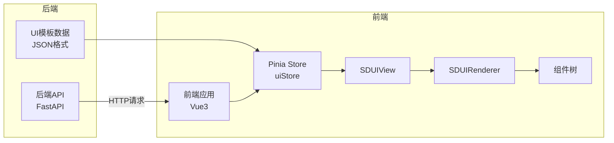
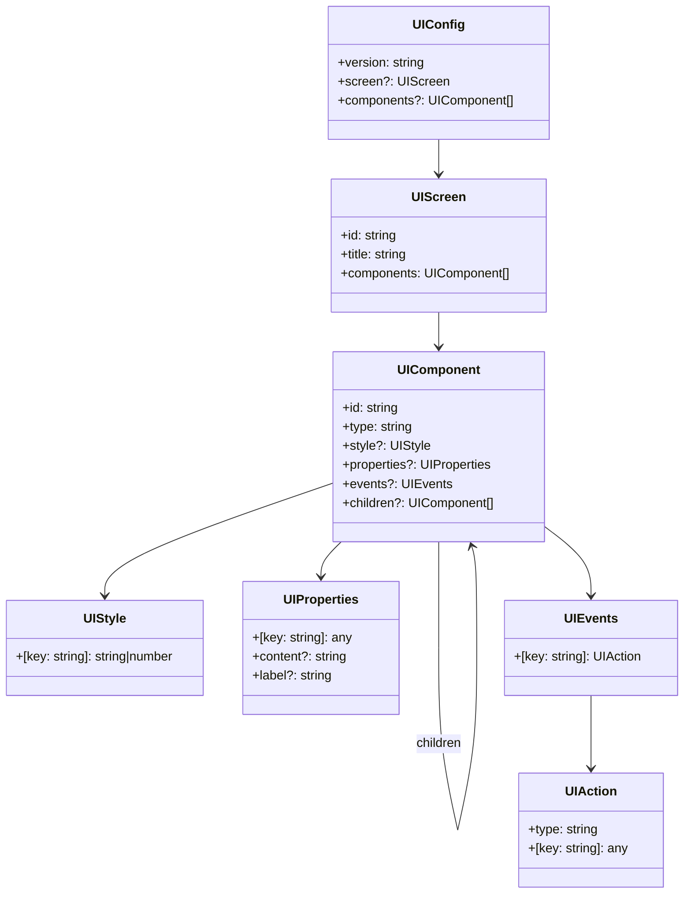
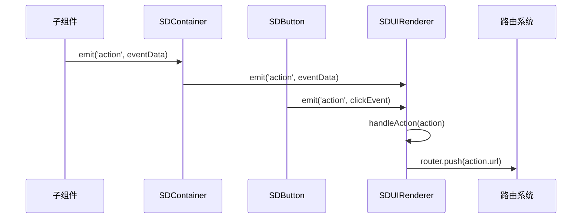

# SDUI渲染器实现

**日期**: 2025-03-28
**类别**: 前端
**紧急程度**: 高

## 问题描述

SDUI框架需要一个前端渲染引擎，能够根据后端提供的UI配置动态渲染组件。原有的实现只能展示JSON配置，没有真正的渲染功能。

## 问题分析

SDUI系统的核心是服务端下发UI配置，客户端负责渲染。这要求前端能够：

1. 解析后端提供的UI配置
2. 动态注册和使用组件
3. 处理组件的属性、样式和事件
4. 实现组件间的嵌套和通信

原有的`SDUIView`组件只能显示接收到的JSON数据，没有实现渲染逻辑，需要开发一个完整的渲染引擎。

## 解决思路

设计一个基于Vue 3的SDUI渲染引擎，包括以下关键部分：

1. **类型定义**：为UI配置和组件定义清晰的TypeScript接口
2. **组件注册系统**：建立类型与组件的映射关系
3. **基础组件库**：实现容器、文本、按钮等基础组件
4. **渲染器**：创建一个递归渲染组件树的引擎
5. **事件处理**：实现组件间的事件通信机制

## 执行步骤

### 1. 创建类型定义

首先创建`types/sdui.ts`文件，定义UI配置和组件相关的接口：

```typescript
export interface UIStyle {
  [key: string]: string | number;
}

export interface UIProperties {
  [key: string]: any;
  content?: string;
  label?: string;
}

export interface UIEvents {
  [key: string]: UIAction;
}

export interface UIAction {
  type: string;
  [key: string]: any;
  url?: string;
  target?: string;
  params?: Record<string, any>;
}

export interface UIComponent {
  id: string;
  type: string;
  style?: UIStyle;
  properties?: UIProperties;
  events?: UIEvents;
  children?: UIComponent[];
}

// 更多类型定义...
```

### 2. 创建基础组件

实现了三个基础组件：

1. **SDContainer**：容器组件，可包含其他组件
2. **SDText**：文本组件，显示文本内容
3. **SDButton**：按钮组件，处理点击事件

每个组件都接收标准的属性、样式和事件，并能够与父组件通信。

### 3. 建立组件注册系统

创建`components/sdui/index.ts`文件，实现组件类型到实际组件的映射：

```typescript
import { Component } from 'vue';
import SDContainer from './SDContainer.vue';
import SDText from './SDText.vue';
import SDButton from './SDButton.vue';

interface ComponentMap {
  [key: string]: Component;
}

const componentMap: ComponentMap = {
  container: SDContainer,
  text: SDText,
  button: SDButton,
};

export default componentMap;
```

### 4. 开发渲染器组件

创建`SDUIRenderer.vue`组件，负责解析配置并递归渲染组件：

```vue
<template>
  <div class="sdui-renderer">
    <!-- 渲染逻辑 -->
    <component
      v-for="component in rootComponents"
      :key="component.id"
      :is="getComponentType(component.type)"
      v-bind="mapProps(component)"
      @action="handleAction"
    />
  </div>
</template>

<script setup>
// 渲染器实现代码
</script>
```

### 5. 整合到视图组件

更新`SDUIView.vue`组件，使用新的渲染器替代原来的JSON显示：

```vue
<template>
  <div class="sdui-view">
    <!-- 其他逻辑 -->
    
    <!-- 使用SDUI渲染器组件 -->
    <SDUIRenderer :config="uiConfig" />
  </div>
</template>
```

## 结果验证

实现后，SDUI系统能够：

1. 动态加载后端提供的UI配置
2. 根据配置渲染组件树
3. 处理组件的样式和属性
4. 响应事件并执行相应操作（如导航）

目前已实现三个基础组件（容器、文本、按钮），可以满足简单界面的渲染需求。

## 注意事项

1. **类型安全**：使用TypeScript接口确保类型安全
2. **组件扩展**：添加新组件时需更新组件注册系统
3. **性能考量**：大型组件树可能需要优化渲染性能
4. **错误处理**：已添加错误边界和降级显示
5. **事件冒泡**：组件事件通过emit向上传递，**实现统一处理**

## 架构设计图

### 组件结构图
****
```**mermaid**
flowchart TB
    App[前端应用\nApp.vue] --> SDUIView[视图层\nSDUIView]
    SDUIView --> SDUIRenderer[渲染引擎\nSDUIRenderer]
    SDUIRenderer --> SDContainer[SDContainer\n容器组件]
    SDUIRenderer --> SDText[SDText\n文本组件]
    SDUIRenderer --> SDButton[SDButton\n按钮组件]
    SDContainer --> ChildComponent1[子组件1]
    SDContainer --> ChildComponent2[子组件2]
    
    subgraph 视图层
        SDUIView
    end
    
    subgraph 渲染引擎
        SDUIRenderer
    end
    
    subgraph 组件库
        SDContainer
        SDText
        SDButton
    end
```

### 数据流向图



### 类型系统关系图



### 组件通信机制

