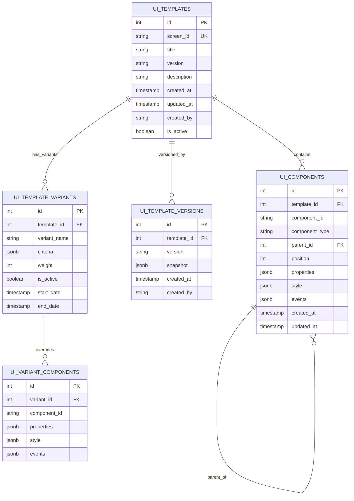

# SDUI框架页面数据存储设计

**日期**: 2025-03-28
**类别**: 架构/后端
**紧急程度**: 高

## 问题描述

SDUI框架需要一个可靠、灵活的数据存储方案，用于保存UI页面定义及其组件结构。这是整个框架的核心，直接影响到系统的功能性、性能和可维护性。

## 解决方案概述

我们采用了基于PostgreSQL的关系型数据库存储方案，结合JSONB类型提供灵活性，同时使用Redis作为缓存层提升性能。

### 核心设计思想

1. **关系型结构 + JSON灵活性**：
   - 使用关系表存储核心结构和关系
   - 使用JSONB类型存储动态属性和样式
   
2. **可维护的组件树**：
   - 使用父子关系表示组件嵌套
   - 支持灵活的组件重排和重用
   
3. **内置版本控制**：
   - 自动记录模板变更历史
   - 支持版本回滚和比较
   
4. **缓存策略**：
   - 使用Redis缓存完整UI树
   - 支持增量更新和部分刷新

## 数据库模型

### 数据库架构图



### 主要表说明

1. **ui_templates**:
   - 存储页面模板的基本信息
   - 每个页面对应一个记录（如首页、详情页）
   
2. **ui_components**:
   - 存储组件数据和结构
   - 使用parent_id实现嵌套关系
   - position字段控制同级组件的排序
   
3. **ui_template_versions**:
   - 记录模板的历史版本
   - 使用JSONB快照保存完整状态
   
4. **ui_template_variants**:
   - 支持A/B测试和个性化显示
   - criteria字段存储匹配条件

### 自动化功能

系统包含以下自动化触发器和函数：

1. **更新时间戳**：自动记录记录的最后修改时间
2. **版本快照**：当模板版本更新时自动创建历史记录
3. **审计日志**：跟踪所有数据变更，记录修改人和修改内容
4. **树构建**：递归构建组件树JSON，用于API响应

## 数据流程

### 存储流程

```mermaid
sequenceDiagram
    参与者 编辑器
    参与者 API服务
    参与者 数据库
    参与者 缓存
    
    编辑器->>API服务: 保存模板(模板ID, 组件树)
    API服务->>数据库: 开始事务
    API服务->>数据库: 更新模板基本信息
    loop 组件处理
        API服务->>数据库: 创建/更新组件
    end
    API服务->>数据库: 提交事务
    数据库-->>数据库: 触发版本快照创建
    API服务->>缓存: 清除相关缓存
    API服务-->>编辑器: 返回成功
```

### 读取流程

```mermaid
sequenceDiagram
    参与者 客户端
    参与者 API服务
    参与者 缓存
    参与者 数据库
    
    客户端->>API服务: 请求UI配置(屏幕ID)
    API服务->>缓存: 查找缓存
    
    alt 缓存命中
        缓存-->>API服务: 返回缓存数据
    else 缓存未命中
        API服务->>数据库: 查询模板
        API服务->>数据库: 查询组件
        API服务->>API服务: 构建组件树
        API服务->>缓存: 存储结果
    end
    
    API服务-->>客户端: 返回UI配置
```

## 性能优化

1. **缓存策略**:
   - 缓存完整的组件树JSON
   - 使用版本号作为缓存键的一部分
   - 修改模板时自动失效相关缓存

2. **索引优化**:
   - 为template_id和parent_id创建索引
   - 为经常查询的字段创建索引

3. **JSON查询优化**:
   - 利用PostgreSQL的JSONB索引
   - 对大型JSON使用GIN索引

## 实施计划

1. **核心表创建** - 完成
   - 基本表结构
   - 关系和约束
   
2. **自动化逻辑** - 完成
   - 触发器和存储过程
   - 审计和版本控制
   
3. **API开发** - 进行中
   - CRUD操作
   - 树形数据转换
   
4. **缓存层实现** - 待完成
   - Redis集成
   - 缓存策略优化

## 未来扩展

1. **多语言支持**
   - 添加语言变体表
   - 实现本地化文本存储
   
2. **动态配置**
   - 条件渲染规则
   - 上下文感知UI
   
3. **使用分析**
   - 存储交互数据
   - 实现热图和优化建议

## 注意事项

1. 所有SQL脚本已存储在 `postgres-init/` 目录中
2. 包含DDL (数据定义) 和示例DML (数据操作)
3. 数据库设计支持未来扩展，而不需要大规模重构
4. 使用事务确保数据一致性，特别是更新组件树时 